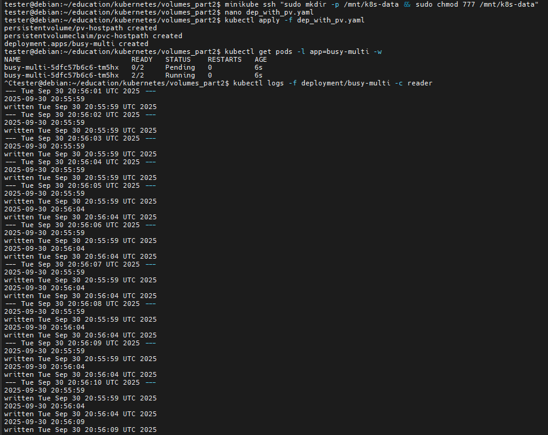
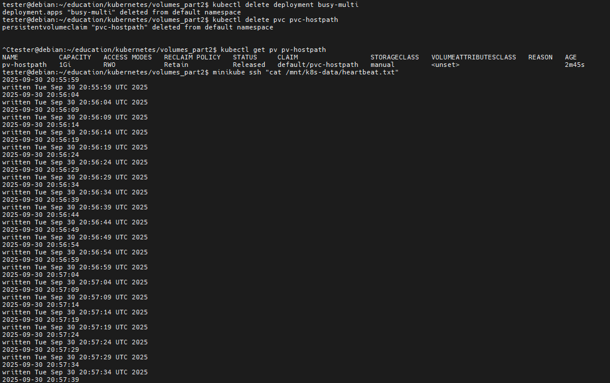
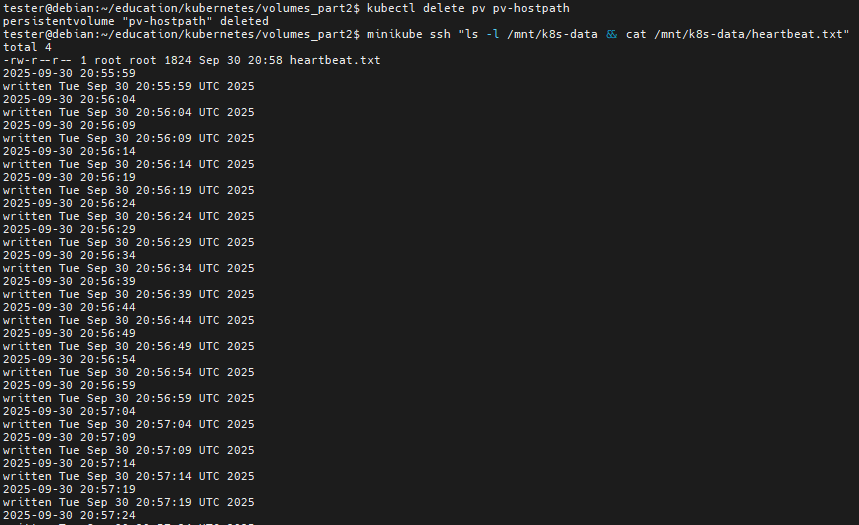
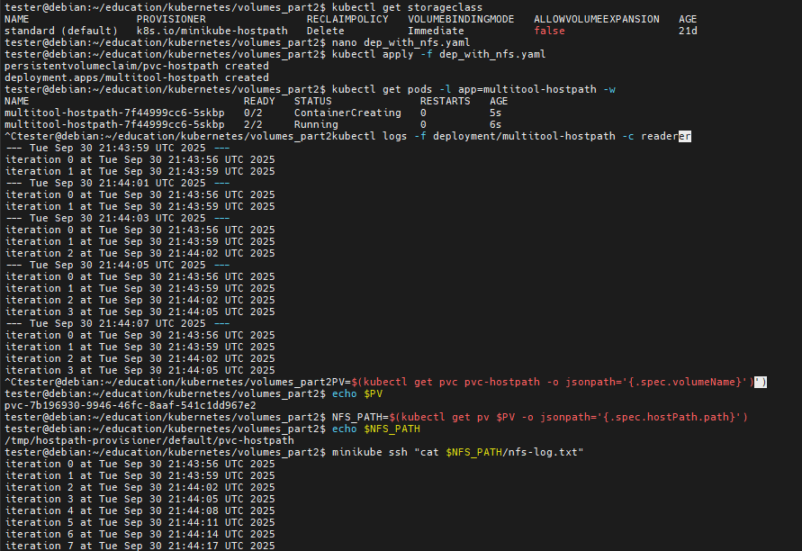

# Домашнее задание к занятию «Хранение в K8s. Часть 2»

## Описание заданий

https://github.com/netology-code/kuber-homeworks/blob/main/2.2/2.2.md

### Цель задания

В тестовой среде Kubernetes нужно создать PV и продемострировать запись и хранение файлов.

------

### Чеклист готовности к домашнему заданию

1. Установленное K8s-решение (например, MicroK8S).
2. Установленный локальный kubectl.
3. Редактор YAML-файлов с подключенным GitHub-репозиторием.

------

### Дополнительные материалы для выполнения задания

1. [Инструкция по установке NFS в MicroK8S](https://microk8s.io/docs/nfs). 
2. [Описание Persistent Volumes](https://kubernetes.io/docs/concepts/storage/persistent-volumes/). 
3. [Описание динамического провижининга](https://kubernetes.io/docs/concepts/storage/dynamic-provisioning/). 
4. [Описание Multitool](https://github.com/wbitt/Network-MultiTool).

------

### Задание 1 

**Что нужно сделать**

Создать Deployment приложения, использующего локальный PV, созданный вручную.

1. Создать Deployment приложения, состоящего из контейнеров busybox и multitool.
2. Создать PV и PVC для подключения папки на локальной ноде, которая будет использована в поде.
3. Продемонстрировать, что multitool может читать файл, в который busybox пишет каждые пять секунд в общей директории. 
4. Удалить Deployment и PVC. Продемонстрировать, что после этого произошло с PV. Пояснить, почему.
5. Продемонстрировать, что файл сохранился на локальном диске ноды. Удалить PV.  Продемонстрировать что произошло с файлом после удаления PV. Пояснить, почему.
6. Предоставить манифесты, а также скриншоты или вывод необходимых команд.

------

### Задание 2

**Что нужно сделать**

Создать Deployment приложения, которое может хранить файлы на NFS с динамическим созданием PV.

1. Включить и настроить NFS-сервер.
2. Создать Deployment приложения состоящего из multitool, и подключить к нему PV, созданный автоматически на сервере NFS.
3. Продемонстрировать возможность чтения и записи файла изнутри пода. 
4. Предоставить манифесты, а также скриншоты или вывод необходимых команд.

------

## Выполнение заданий

### Чек окружения

```
Debian 12 x86_64

minikube - https://minikube.sigs.k8s.io/docs/start/

docker - https://www.docker.com/get-started/

local kubectl - https://kubernetes.io/docs/tasks/tools/install-kubectl-linux/

# docker ready

# install minikube
curl -LO https://storage.googleapis.com/minikube/releases/latest/minikube_latest_amd64.deb
sudo dpkg -i minikube_latest_amd64.deb
minikube start
minikube status

# local kubectl
curl -LO "https://dl.k8s.io/release/$(curl -L -s https://dl.k8s.io/release/stable.txt)/bin/linux/amd64/kubectl"
sudo install -o root -g root -m 0755 kubectl /usr/local/bin/kubectl
kubectl version --client
kubectl get nodes

```

### Решение 1

Создадим на ноде директорию для общих файлов
```
minikube ssh "sudo mkdir -p /mnt/k8s-data && sudo chmod 777 /mnt/k8s-data"
```

Создадим Deployment приложения, использующего локальный PV, созданный вручную - dep_with_pv.yaml
```
apiVersion: v1
kind: PersistentVolume
metadata:
  name: pv-hostpath
spec:
  capacity:
    storage: 1Gi
  accessModes:
    - ReadWriteOnce
  persistentVolumeReclaimPolicy: Retain   # важный момент – файл не будет удалён автоматически
  storageClassName: manual
  hostPath:
    path: /mnt/k8s-data          # путь, который создали на ноде
---
apiVersion: v1
kind: PersistentVolumeClaim
metadata:
  name: pvc-hostpath
spec:
  storageClassName: manual
  accessModes:
    - ReadWriteOnce
  resources:
    requests:
      storage: 500Mi
---
apiVersion: apps/v1
kind: Deployment
metadata:
  name: busy-multi
spec:
  replicas: 1
  selector:
    matchLabels:
      app: busy-multi
  template:
    metadata:
      labels:
        app: busy-multi
    spec:
      containers:
        # busybox – пишет каждые 5 сек
        - name: writer
          image: busybox
          command: ["/bin/sh","-c"]
          args:
            - |
              while true; do
                date +"%Y-%m-%d %H:%M:%S" >> /data/heartbeat.txt
                echo "written $(date)" >> /data/heartbeat.txt
                sleep 5
              done
          volumeMounts:
            - name: shared-data
              mountPath: /data
        # multitool – читает каждую секунду
        - name: reader
          image: wbitt/network-multitool
          command: ["/bin/sh","-c"]
          args:
            - |
              while true; do
                echo "--- $(date) ---"
                cat /data/heartbeat.txt || echo "file not ready"
                sleep 1
              done
          volumeMounts:
            - name: shared-data
              mountPath: /data
      volumes:
        - name: shared-data
          persistentVolumeClaim:
            claimName: pvc-hostpath
```

Применяем манифест и смотрим логи ридера
```
kubectl apply -f dep_with_pv.yaml
kubectl get pods -l app=busy-multi -w
kubectl logs -f deployment/busy-multi -c reader
```


Удаляем Deployment и PVC, наблюдаем за PV
```
kubectl delete deployment busy-multi
kubectl delete pvc pvc-hostpath

kubectl get pv pv-hostpath
```

Проверяем, что файл действительно сохранился на ноде
```
# Политика Retain говорит контроллеру не удалять данные. Поэтому директория /mnt/k8s-data остаётся нетронутой, а PV остаётся в состоянии Released (можно «перепривязать» к новому PVC).

minikube ssh "cat /mnt/k8s-data/heartbeat.txt"
```


Удаляем PV и наблюдаем, что происходит с файлом - должен оставаться
```
kubectl delete pv pv-hostpath
minikube ssh "ls -l /mnt/k8s-data && cat /mnt/k8s-data/heartbeat.txt"
```


Чистим всё
```
kubectl delete -f dep_with_pv.yaml
minikube ssh "sudo rm -rf /mnt/k8s-data"
```

### Решение 2

Проверяем наличие средств для эмуляции работы с nfs хранилищем в minikube
```
kubectl get storageclass # вывод standard (default)
```

Создаём deployment, использующий эмулированный nfs - dep_with_nfs.yaml
```
apiVersion: v1
kind: PersistentVolumeClaim
metadata:
  name: pvc-hostpath
spec:
  storageClassName: standard # используем уже существующий SC
  accessModes:
    - ReadWriteMany
  resources:
    requests:
      storage: 1Gi
---
apiVersion: apps/v1
kind: Deployment
metadata:
  name: multitool-hostpath
spec:
  replicas: 1
  selector:
    matchLabels:
      app: multitool-hostpath
  template:
    metadata:
      labels:
        app: multitool-hostpath
    spec:
      containers:
        - name: writer
          image: busybox
          command: ["/bin/sh","-c"]
          args:
            - |
              i=0
              while true; do
                echo "iteration $i at $(date)" >> /data/nfs-log.txt
                i=$((i+1))
                sleep 3
              done
          volumeMounts:
            - name: data
              mountPath: /data
        - name: reader
          image: wbitt/network-multitool
          command: ["/bin/sh","-c"]
          args:
            - |
              while true; do
                echo "--- $(date) ---"
                cat /data/nfs-log.txt || echo "file empty"
                sleep 2
              done
          volumeMounts:
            - name: data
              mountPath: /data
      volumes:
        - name: data
          persistentVolumeClaim:
            claimName: pvc-hostpath
```

Создаём всё и ждём поднятия
```
kubectl apply -f dep_with_nfs.yaml
kubectl get pods -l app=multitool-hostpath -w
```

Пробуем читать
```
kubectl logs -f deployment/multitool-hostpath -c reader
```

Смотрим на эмулированный nfs
```
PV=$(kubectl get pvc pvc-hostpath -o jsonpath='{.spec.volumeName}')
NFS_PATH=$(kubectl get pv $PV -o jsonpath='{.spec.hostPath.path}')
minikube ssh "cat $NFS_PATH/nfs-log.txt"
```


Чистим всё
```
kubectl delete -f dep_with_nfs.yaml
# minikube ssh "rm $NFS_PATH/nfs-log.txt" # не нужно, само всё удалится
```